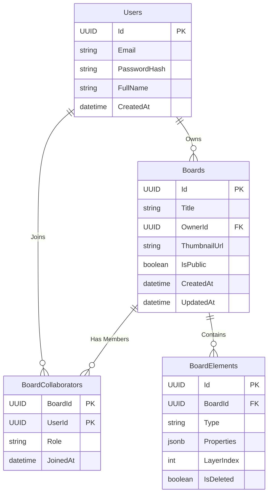

# 🎨 Miro Clone Architecture & Roadmap

## 🚀 1. Project Features (Roadmap)

### 🛠️ Phase 1: MVP (Core Functionality)
> **الهدف:** بناء الأساسيات ورسم الأشكال وعمل Save/Load.

- [ ] **Authentication:**
  - Login / Register (Email & Password).
  - JWT Token generation for API access.
- [ ] **Dashboard:**
  - عرض كل اللوحات (Boards) الخاصة بالمستخدم.
  - إنشاء لوحة جديدة (Create Board).
  - مسح لوحة (Delete Board).
- [ ] **Canvas (Whiteboard):**
  - **Toolbar:** اختيار الأدوات (Rectangle, Circle, Text, Pencil/Path).
  - **Drawing:** رسم الأشكال على الـ Canvas.
  - **Selection:** اختيار شكل معين لتعديله.
  - **Transformation:** تغيير الحجم (Resize) والنقل (Drag & Drop).
  - **Deletion:** مسح شكل محدد.
- [ ] **Persistence:**
  - حفظ حالة اللوحة تلقائياً (Auto-save) أو عند التغيير.
  - تحميل الأشكال عند فتح الصفحة.

### ✨ Phase 2: Collaboration & Real-time (The Magic)
> **الهدف:** جعل اللوحة تفاعلية بين أكثر من مستخدم في نفس الوقت.

- [ ] **Real-time Updates (SignalR):**
  - بث التغييرات (Broadcast) عند رسم أو تحريك شكل لباقي المتصلين.
- [ ] **Live Cursors:**
  - ظهور مؤشرات الماوس الخاصة بالمستخدمين الآخرين بأسمائهم وألوان مختلفة.
- [ ] **Concurrency Handling:**
  - التأكد من عدم تعارض التعديلات (Optimistic locking if needed).

### 🔮 Phase 3: Advanced Features
> **الهدف:** تحسين تجربة المستخدم وإضافة أدوات احترافية.

- [ ] **Styling:** تغيير ألوان الخلفية (Fill) والإطار (Stroke) وسمك الخط.
- [ ] **Undo / Redo:** التراجع عن الخطوات (Local History).
- [ ] **Zoom & Pan:** التحرك داخل اللوحة وتقريب/تبعيد الكاميرا.
- [ ] **Images:** رفع صور وإضافتها للوحة.
- [ ] **Export:** تصدير اللوحة كصورة (PNG/JPG).

---

## 📊 2. Entity Relationship Diagram (ERD)

العلاقات بين الجداول في قاعدة البيانات.

## 🗄️ 3. Database Mapping (Data Dictionary)
تفاصيل الجداول لاستخدامها في Entity Framework Core.

### 👤 1. Users Table
جدول المستخدمين.

| Column Name | C# Type | SQL Type (Postgres/SQL) | Description |
|---|---|---|---|
| Id | Guid | UUID / UNIQUEIDENTIFIER | PK |
| Email | string | VARCHAR(255) | Unique Index |
| PasswordHash | string | VARCHAR(MAX) | Securely hashed password |
| FullName | string | VARCHAR(100) | Display name for live cursors |
| CreatedAt | DateTime | TIMESTAMP | |

### 📂 2. Boards Table
حاوية المشروع.

| Column Name | C# Type | SQL Type | Description |
|---|---|---|---|
| Id | Guid | UUID | PK |
| Title | string | VARCHAR(200) | Board name |
| OwnerId | Guid | UUID | FK -> Users.Id |
| ThumbnailUrl | string? | VARCHAR(MAX) | Optional preview image |
| IsPublic | bool | BOOLEAN | Public access flag |
| CreatedAt | DateTime | TIMESTAMP | |
| UpdatedAt | DateTime | TIMESTAMP | Used for sorting recent boards |

### 🎨 3. BoardElements Table (⚠️ Core Data)
جدول العناصر المرسومة.

| Column Name | C# Type | SQL Type | Description |
|---|---|---|---|
| Id | Guid | UUID | PK. Generated often on client-side |
| BoardId | Guid | UUID | FK -> Boards.Id (Indexed) |
| Type | string | VARCHAR(50) | Enums: rect, ellipse, path, text |
| Properties | JsonDocument | JSONB / NVARCHAR(MAX) | Stores x, y, width, height, color, points |
| LayerIndex | int | INT | Controls Z-Index (Stacking order) |
| IsDeleted | bool | BOOLEAN | For Soft Delete & Undo support |

### 👥 4. BoardCollaborators Table
جدول المشاركة (Many-to-Many).

| Column Name | C# Type | SQL Type | Description |
|---|---|---|---|
| BoardId | Guid | UUID | PK, FK |
| UserId | Guid | UUID | PK, FK |
| Role | string | VARCHAR(20) | Viewer, Editor |
| JoinedAt | DateTime | TIMESTAMP | |