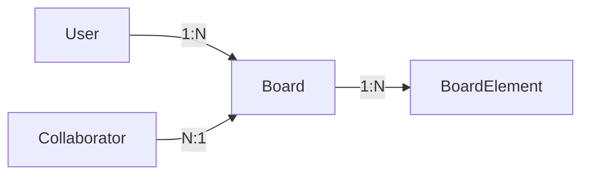

# 🎨 Project: Ultimate Whiteboard (Miro Clone ++)

## 1. 🌟 الميزات الأساسية والمتقدمة (Feature Set)

يهدف المشروع لبناء لوحة بيضاء تعاونية تجمع بين مرونة الرسم اليدوي (Excalidraw) وقوة التوثيق التقني (Mermaid) وتنظيم (Lucidchart).

### A. الأساسيات (Core Canvas)

- **Infinite Canvas**: لوحة غير محدودة مع دعم الـ Pan (التحريك) و Zoom.
- **Basic Shapes**: مستطيل، دائرة، معين، مثلث.
- **Text & Sticky Notes**: كتابة نصوص وملاحظات لاصقة.
- **Freehand Drawing**: قلم للرسم الحر (Pencil tool).
- **Transformation**: تحريك، تغيير حجم، وتدوير العناصر.

### B. ميزات المطورين (Killer Feature #1: Mermaid) 🤖

- **Code-to-Diagram Widget**:
  - مربع إدخال (Input Block) يقبل كود Mermaid.js.
  - تحويل الكود فورياً (Real-time render) إلى رسم بياني SVG غير قابل للتعديل يدويًا (يعدل عبر الكود فقط).
  - مثال: كتابة `A --> B` تتحول لمربعين وسهم.

### C. ميزات التصميم وتجربة المستخدم (Killer Feature #2: Hand-Drawn) ✏️

- **Sloppy/Sketch Mode**: زر تحويل (Toggle) يجعل جميع الخطوط المستقيمة والأشكال تبدو وكأنها مرسومة باليد (باستخدام مكتبة Rough.js).
- **Smart Connectors**: خطوط ذكية تربط بين الأشكال (Binding)، وتتحرك معها تلقائياً.

### D. التعاون المباشر (Real-Time Collaboration) 🚀

- **Live Cursors**: رؤية مؤشرات الماوس للآخرين بأسمائهم.
- **Broadcasting**: أي تعديل (رسم، مسح، تحريك) يظهر عند الجميع في أجزاء من الثانية.

---

## 2. 🗄️ Database Schema & Architecture

سنعتمد على **Next.js (Frontend)** و **.NET Core (Backend)**. قاعدة البيانات المقترحة هي **PostgreSQL** (لأنها الأفضل في التعامل مع JSONB) أو SQL Server.

### أ) مخطط العلاقات (ER Diagram Overview)



### ب) تفاصيل الجداول (Schema Definition)

#### 1. Table: `Users`

| Column         | Type         | Description                     |
| :------------- | :----------- | :------------------------------ |
| `Id`           | UUID (PK)    | المعرف الفريد                   |
| `Email`        | VARCHAR(255) | البريد الإلكتروني (Unique)      |
| `PasswordHash` | TEXT         | كلمة المرور المشفرة             |
| `DisplayName`  | VARCHAR(100) | الاسم الذي يظهر فوق مؤشر الماوس |

#### 2. Table: `Boards`

| Column      | Type         | Description   |
| :---------- | :----------- | :------------ |
| `Id`        | UUID (PK)    | معرف اللوحة   |
| `Title`     | VARCHAR(200) | عنوان المشروع |
| `OwnerId`   | UUID (FK)    | صاحب اللوحة   |
| `CreatedAt` | TIMESTAMP    | تاريخ الإنشاء |

#### 3. Table: `BoardElements` (The Core Table)

هذا الجدول يخزن كل شيء (مربع، خط، كود mermaid).

| Column     | Type        | Description                                                   |
| :--------- | :---------- | :------------------------------------------------------------ |
| `Id`       | UUID (PK)   | معرف العنصر (يتم توليده في الـ Frontend غالباً)               |
| `BoardId`  | UUID (FK)   | اللوحة التابع لها (Indexed)                                   |
| `Type`     | VARCHAR(50) | نوع العنصر: `rect`, `ellipse`, `text`, `connector`, `mermaid` |
| `Data`     | JSONB       | **أهم عمود**: يخزن كل خصائص الشكل (انظر الأسفل)               |
| `ZIndex`   | INT         | ترتيب الطبقات (من فوق من)                                     |
| `IsLocked` | BOOLEAN     | هل العنصر مقفول ولا يمكن تحريكه؟                              |

### ج) هيكل البيانات (JSON Data Structure)

كيف سيتم تخزين البيانات داخل عمود `Data` بناءً على نوع العنصر:

#### 1. شكل هندسي (Shape):

```json
{
  "x": 100,
  "y": 200,
  "width": 150,
  "height": 100,
  "backgroundColor": "#ff0000",
  "strokeColor": "#000000",
  "roughness": 1,
  "text": "Hello World"
}
```

_(Note: `roughness`: 0 = Sharp, 1+ = Hand-drawn style)_

#### 2. كود ميرميد (Mermaid Widget):

```json
{
  "x": 300,
  "y": 50,
  "code": "graph TD; A[Client] --> B[Server];",
  "scale": 1.5
}
```

#### 3. موصل ذكي (Smart Connector):

```json
{
  "startElementId": "uuid-of-shape-A",
  "endElementId": "uuid-of-shape-B",
  "startPoint": { "x": 0, "y": 0 },
  "endPoint": { "x": 100, "y": 100 },
  "style": "dashed"
}
```

_(Note: `startPoint` is a fallback if no element is attached)_

---

## 3. 💻 .NET Backend Implementation Guide

### 1. C# Models (DTOs)

استخدام الوراثة للتعامل مع الـ JSON بذكاء.

```csharp
// Base Class
public class BoardElement
{
    public Guid Id { get; set; }
    public Guid BoardId { get; set; }
    public string Type { get; set; } // "rect", "mermaid", etc.
    public int ZIndex { get; set; }

    // This maps to the JSONB column
    public JsonDocument Data { get; set; }
}

// SignalR Hub Interface
public interface IBoardClient
{
    Task ReceiveShapeUpdate(BoardElement element);
    Task ReceiveCursorMove(Guid userId, double x, double y);
    Task ReceiveShapeDelete(Guid elementId);
}
```

### 2. SignalR Hub Logic

```csharp
public class BoardHub : Hub<IBoardClient>
{
    // Join a specific board channel
    public async Task JoinBoard(string boardId)
    {
        await Groups.AddToGroupAsync(Context.ConnectionId, boardId);
    }

    // Broadcast shape changes
    public async Task UpdateShape(string boardId, BoardElement element)
    {
        // 1. Save to DB (Service Call)
        // 2. Broadcast to others in the group
        await Clients.OtherInGroup(boardId).ReceiveShapeUpdate(element);
    }
}
```

---

## 4. 🛠️ Roadmap & Step-by-Step Plan

### المرحلة 1: التأسيس (Foundation & Canvas)

- [ ] **Setup**: إنشاء مشروع Next.js ومشروع .NET API.
- [ ] **Canvas Lib**: تثبيت `react-konva` (لأداء عالي) أو استخدام SVG عادي.
- [ ] **Basic Drawing**: رسم المربعات والدوائر وتحريكها (Local State only).
- [ ] **API & DB**: إنشاء الجداول، وعمل Endpoints لـ (Create Board, Get Board Elements).
- [ ] **Save/Load**: ربط الـ Frontend بالـ API لحفظ الرسمة واسترجاعها.

### المرحلة 2: الميزات التنافسية (The "Killer" Features)

- [ ] **Mermaid Integration**:
  - تثبيت `mermaid` في الـ Next.js.
  - عمل Component جديد `MermaidShape`.
  - عندما يكتب المستخدم الكود، يتم عمل `mermaid.render` وتحويله لصورة داخل الـ Canvas.
- [ ] **Hand-Drawn Style**:
  - تثبيت `roughjs`.
  - عند تفعيل الزر، يتم رسم الأشكال باستخدام `rough.canvas` بدلاً من الخطوط المستقيمة.
- [ ] **Smart Lines**:
  - برمجة منطق رسم الخط بين نقطتي مركز شكلين (Center to Center).

### المرحلة 3: الـ Real-time (SignalR)

- [ ] **Connection**: إعداد SignalR Client في Next.js.
- [ ] **Sync**: عند رسم شكل، أرسل event لـ SignalR، وعند استقبال event، قم بتحديث الـ React State.
- [ ] **Cursors**: إرسال إحداثيات الماوس (Throttle every 50ms) لتقليل الحمل على السيرفر.

---

## 5. 📚 Tech Stack Recommendations (Specific Libraries)

| المجال            | التقنية/المكتبة          | السبب                                                                |
| :---------------- | :----------------------- | :------------------------------------------------------------------- |
| **Frontend**      | Next.js 14+ (App Router) | الأحدث والأسرع.                                                      |
| **Canvas**        | React Konva              | مكتبة قوية جداً للتعامل مع الـ Canvas وتدعم الـ Drag & Drop بامتياز. |
| **Diagrams**      | Mermaid.js               | لتحويل النص إلى رسوم بيانية.                                         |
| **Sketchy Style** | Rough.js                 | لتحويل الأشكال الهندسية لتبدو يدوية.                                 |
| **State Mngt**    | Zustand                  | أخف وأسهل من Redux لإدارة حالة العناصر في اللوحة.                    |
| **Backend**       | .NET 8 Web API           | أداء عالي جداً.                                                      |
| **Real-time**     | SignalR                  | الحل القياسي في دوت نت للاتصال اللحظي.                               |
| **Database**      | PostgreSQL               | دعم ممتاز لنوع البيانات JSONB.                                       |
| **ORM**           | Entity Framework Core    | التعامل مع الداتا بيز بسهولة.                                        |
